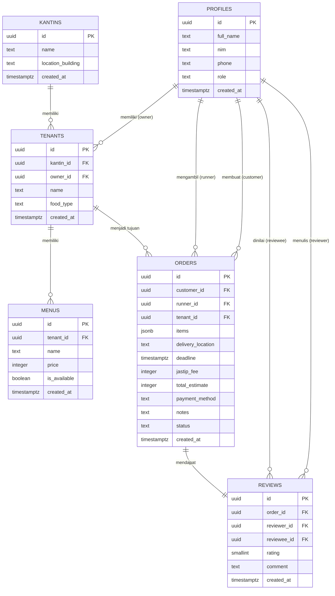
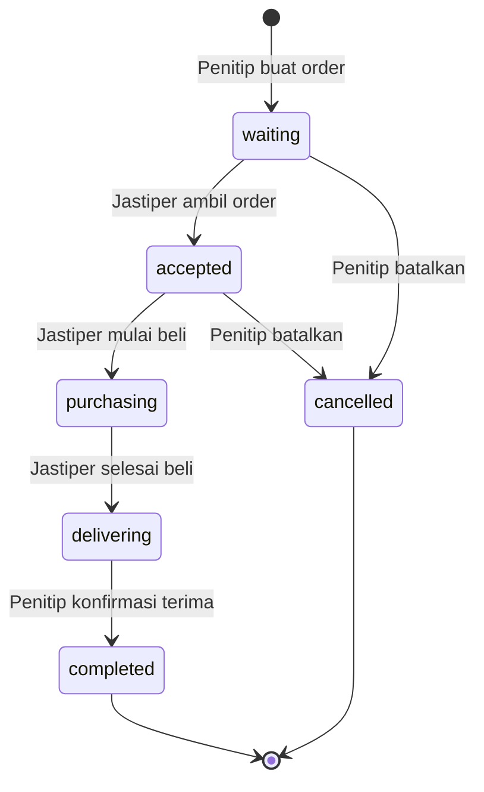

# Entity Relationship Diagram — Titip.in

## Keterangan Relasi

| Relasi | Tipe | Keterangan |
|---|---|---|
| PROFILES → TENANTS | One-to-One | Satu pemilik hanya bisa klaim satu warung |
| PROFILES → ORDERS (customer) | One-to-Many | Satu mahasiswa bisa buat banyak order |
| PROFILES → ORDERS (runner) | One-to-Many | Satu mahasiswa bisa ambil banyak order |
| KANTINS → TENANTS | One-to-Many | Satu kantin memiliki banyak warung/tenant |
| TENANTS → MENUS | One-to-Many | Satu warung memiliki banyak item menu |
| TENANTS → ORDERS | One-to-Many | Satu warung bisa punya banyak order |
| ORDERS → REVIEWS | One-to-One | Satu order hanya bisa diulas sekali |

## Status Order (State Machine)

