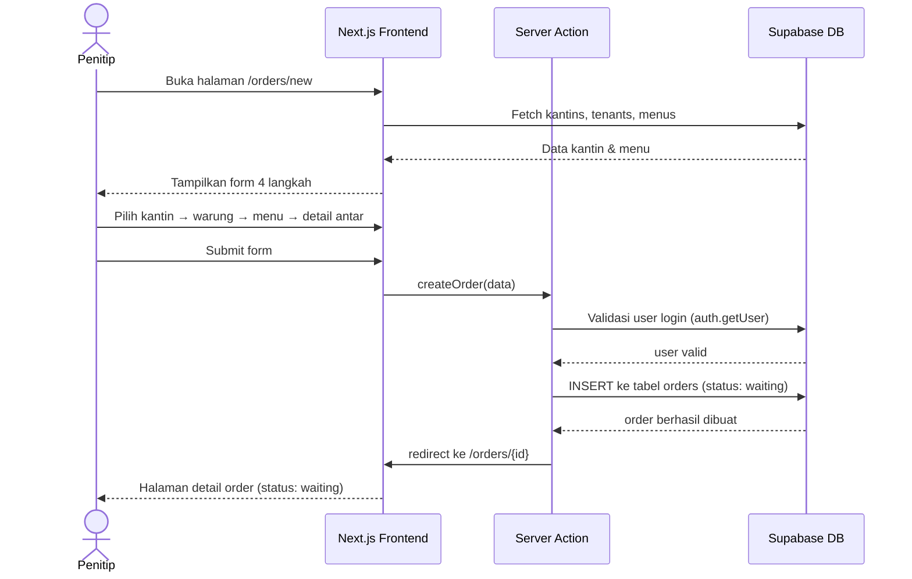
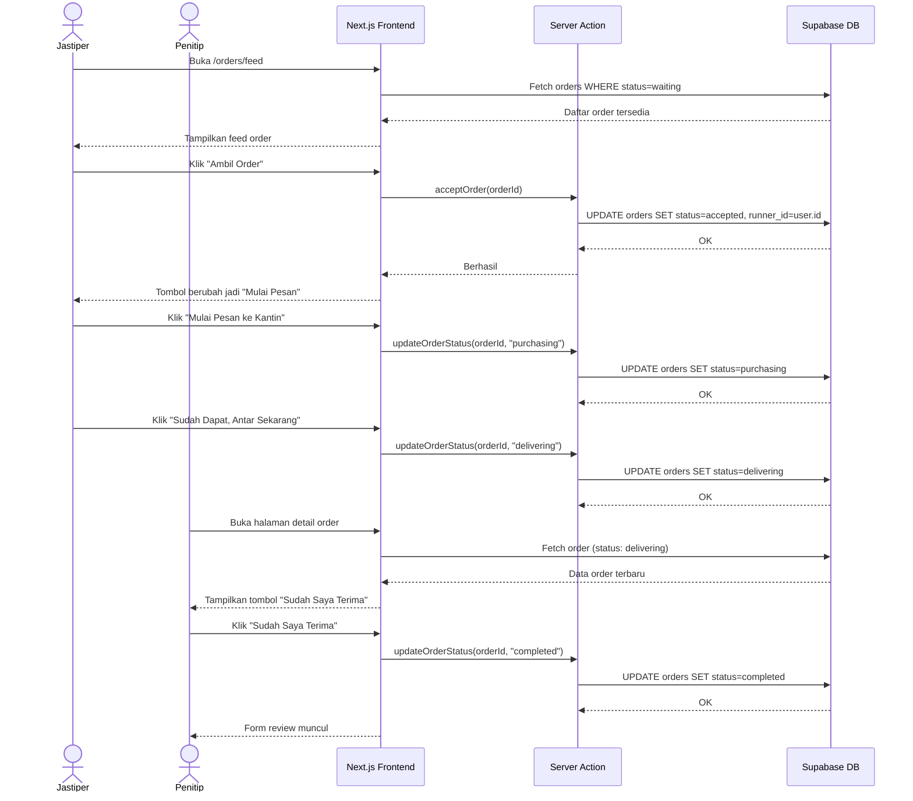
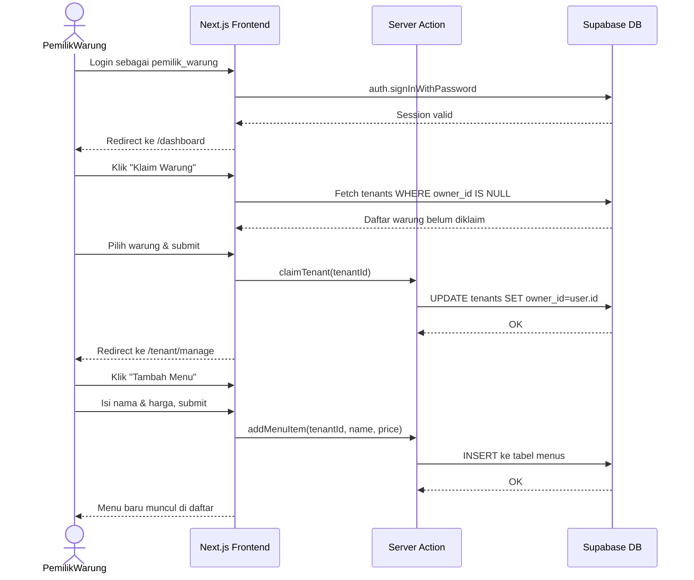

# Sequence Diagram — Alur Order Titip.in

## 1. Alur Membuat Order (Penitip)

```mermaid
sequenceDiagram
    actor Penitip
    participant UI as Next.js Frontend
    participant SA as Server Action
    participant DB as Supabase DB

    Penitip->>UI: Buka halaman /orders/new
    UI->>DB: Fetch kantins, tenants, menus
    DB-->>UI: Data kantin & menu
    UI-->>Penitip: Tampilkan form 4 langkah

    Penitip->>UI: Pilih kantin → warung → menu → detail antar
    Penitip->>UI: Submit form

    UI->>SA: createOrder(data)
    SA->>DB: Validasi user login (auth.getUser)
    DB-->>SA: user valid
    SA->>DB: INSERT ke tabel orders (status: waiting)
    DB-->>SA: order berhasil dibuat
    SA->>UI: redirect ke /orders/{id}
    UI-->>Penitip: Halaman detail order (status: waiting)
```

## 2. Alur Jastiper Mengambil & Menyelesaikan Order

```mermaid
sequenceDiagram
    actor Jastiper
    actor Penitip
    participant UI as Next.js Frontend
    participant SA as Server Action
    participant DB as Supabase DB

    Jastiper->>UI: Buka /orders/feed
    UI->>DB: Fetch orders WHERE status=waiting
    DB-->>UI: Daftar order tersedia
    UI-->>Jastiper: Tampilkan feed order

    Jastiper->>UI: Klik "Ambil Order"
    UI->>SA: acceptOrder(orderId)
    SA->>DB: UPDATE orders SET status=accepted, runner_id=user.id
    DB-->>SA: OK
    SA-->>UI: Berhasil
    UI-->>Jastiper: Tombol berubah jadi "Mulai Pesan"

    Jastiper->>UI: Klik "Mulai Pesan ke Kantin"
    UI->>SA: updateOrderStatus(orderId, "purchasing")
    SA->>DB: UPDATE orders SET status=purchasing
    DB-->>SA: OK

    Jastiper->>UI: Klik "Sudah Dapat, Antar Sekarang"
    UI->>SA: updateOrderStatus(orderId, "delivering")
    SA->>DB: UPDATE orders SET status=delivering
    DB-->>SA: OK

    Penitip->>UI: Buka halaman detail order
    UI->>DB: Fetch order (status: delivering)
    DB-->>UI: Data order terbaru
    UI-->>Penitip: Tampilkan tombol "Sudah Saya Terima"

    Penitip->>UI: Klik "Sudah Saya Terima"
    UI->>SA: updateOrderStatus(orderId, "completed")
    SA->>DB: UPDATE orders SET status=completed
    DB-->>SA: OK
    UI-->>Penitip: Form review muncul
```

## 3. Alur Pemilik Warung Kelola Menu

```mermaid
sequenceDiagram
    actor PemilikWarung
    participant UI as Next.js Frontend
    participant SA as Server Action
    participant DB as Supabase DB

    PemilikWarung->>UI: Login sebagai pemilik_warung
    UI->>DB: auth.signInWithPassword
    DB-->>UI: Session valid
    UI-->>PemilikWarung: Redirect ke /dashboard

    PemilikWarung->>UI: Klik "Klaim Warung"
    UI->>DB: Fetch tenants WHERE owner_id IS NULL
    DB-->>UI: Daftar warung belum diklaim
    PemilikWarung->>UI: Pilih warung & submit

    UI->>SA: claimTenant(tenantId)
    SA->>DB: UPDATE tenants SET owner_id=user.id
    DB-->>SA: OK
    UI-->>PemilikWarung: Redirect ke /tenant/manage

    PemilikWarung->>UI: Klik "Tambah Menu"
    PemilikWarung->>UI: Isi nama & harga, submit
    UI->>SA: addMenuItem(tenantId, name, price)
    SA->>DB: INSERT ke tabel menus
    DB-->>SA: OK
    UI-->>PemilikWarung: Menu baru muncul di daftar
```
