# Use Case Diagram — Titip.in

```mermaid
graph TD
    subgraph Actors
        M["👤 Mahasiswa"]
        PW["🏪 Pemilik Warung"]
        SYS["⚙️ System"]
    end

    subgraph "Titip.in — Use Cases"
        UC1["Daftar Akun"]
        UC2["Login"]
        UC3["Logout"]

        subgraph "Penitip"
            UC4["Buat Titipan"]
            UC5["Pilih Kantin & Warung"]
            UC6["Pilih Menu"]
            UC7["Tentukan Deadline & Lokasi"]
            UC8["Batalkan Order"]
            UC9["Konfirmasi Penerimaan"]
            UC10["Beri Rating Jastiper"]
        end

        subgraph "Jastiper"
            UC11["Lihat Feed Order"]
            UC12["Ambil Order"]
            UC13["Update Status Pembelian"]
            UC14["Update Status Pengantaran"]
        end

        subgraph "Pemilik Warung"
            UC15["Klaim Warung"]
            UC16["Tambah Menu"]
            UC17["Edit Menu & Harga"]
            UC18["Hapus Menu"]
            UC19["Toggle Ketersediaan Menu"]
        end

        subgraph "Umum"
            UC20["Lihat Riwayat Order"]
            UC21["Lihat Profil & Statistik"]
        end
    end

    M --> UC1
    M --> UC2
    M --> UC3
    M --> UC4
    UC4 --> UC5
    UC4 --> UC6
    UC4 --> UC7
    M --> UC8
    M --> UC9
    M --> UC10
    M --> UC11
    M --> UC12
    M --> UC13
    M --> UC14
    M --> UC20
    M --> UC21

    PW --> UC1
    PW --> UC2
    PW --> UC3
    PW --> UC15
    PW --> UC16
    PW --> UC17
    PW --> UC18
    PW --> UC19
    PW --> UC21

    SYS --> UC3
```

## Deskripsi Use Case

| Use Case | Actor | Deskripsi |
|---|---|---|
| UC1 — Daftar Akun | Mahasiswa, Pemilik Warung | Membuat akun baru dengan role tertentu |
| UC2 — Login | Semua | Masuk ke aplikasi menggunakan email & password |
| UC3 — Logout | Semua | Keluar dari sesi aktif |
| UC4 — Buat Titipan | Mahasiswa | Membuat order baru melalui form 4 langkah |
| UC5 — Pilih Kantin & Warung | Mahasiswa | Memilih kantin dan warung tujuan |
| UC6 — Pilih Menu | Mahasiswa | Memilih item menu dari daftar warung |
| UC7 — Tentukan Deadline & Lokasi | Mahasiswa | Mengisi lokasi antar dan batas waktu (hari ini) |
| UC8 — Batalkan Order | Mahasiswa (Penitip) | Membatalkan order yang belum diproses |
| UC9 — Konfirmasi Penerimaan | Mahasiswa (Penitip) | Mengkonfirmasi bahwa makanan sudah diterima |
| UC10 — Beri Rating Jastiper | Mahasiswa (Penitip) | Memberi bintang 1–5 dan komentar ke jastiper |
| UC11 — Lihat Feed Order | Mahasiswa | Melihat daftar order yang menunggu jastiper |
| UC12 — Ambil Order | Mahasiswa (Jastiper) | Mengambil order dari feed untuk dikerjakan |
| UC13 — Update Status Pembelian | Mahasiswa (Jastiper) | Mengubah status ke "purchasing" saat mulai beli |
| UC14 — Update Status Pengantaran | Mahasiswa (Jastiper) | Mengubah status ke "delivering" saat mengantarkan |
| UC15 — Klaim Warung | Pemilik Warung | Mengklaim kepemilikan warung yang tersedia |
| UC16 — Tambah Menu | Pemilik Warung | Menambahkan item menu baru beserta harga |
| UC17 — Edit Menu | Pemilik Warung | Mengubah nama atau harga menu yang sudah ada |
| UC18 — Hapus Menu | Pemilik Warung | Menghapus item menu dari daftar |
| UC19 — Toggle Ketersediaan | Pemilik Warung | Mengaktifkan / menonaktifkan menu |
| UC20 — Lihat Riwayat Order | Mahasiswa | Melihat semua order (aktif, selesai, dibatalkan) |
| UC21 — Lihat Profil | Semua | Melihat info akun dan statistik penggunaan |
